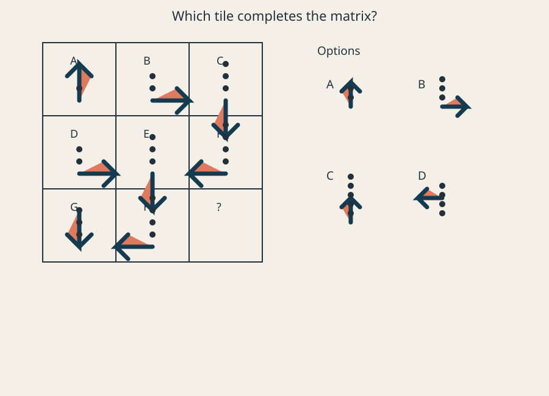
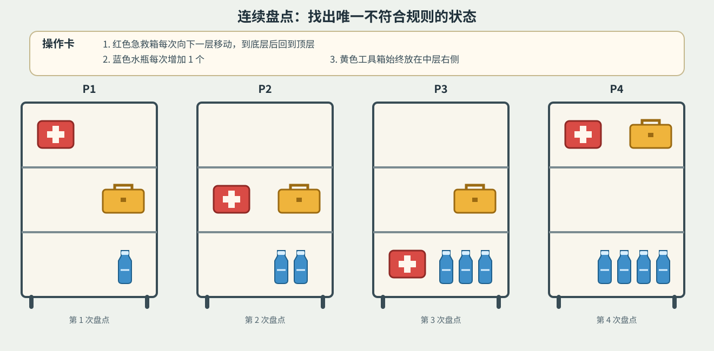
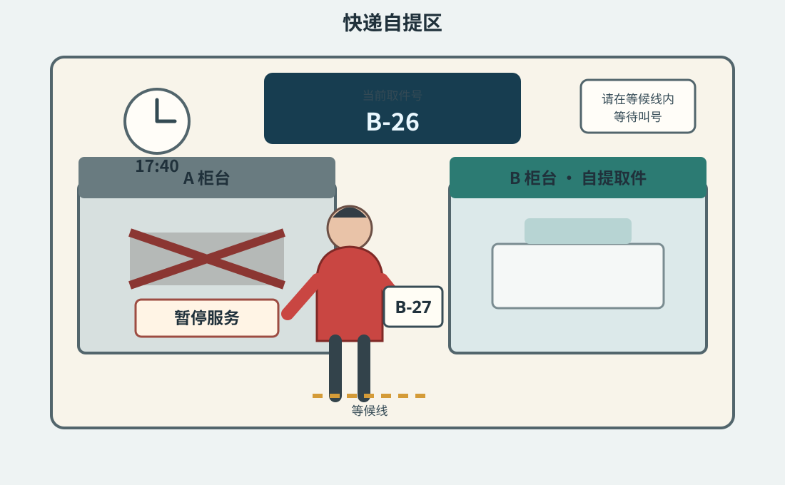

# 模型核心能力测评题库

版本：1.1  
日期：2026-08-03

## 一、题库设计

题库共 21 道题，覆盖推理、Coding、Agent 和多模态理解四类核心能力。题目优先选择能够拉开旗舰模型差距、结果容易核对、任务容易理解，并且能直观说明模型是否真正完成目标的场景。

| 类别 | 题量 | 核心问题 |
|---|---:|---|
| 推理 | 10 道 | 面对复杂条件，模型能不能想对 |
| Coding | 4 道 | 面对真实软件任务，模型能不能改对 |
| Agent | 4 道 | 面对多步骤事务，模型能不能安全、完整地办完 |
| 多模态 | 3 道 | 面对图片信息，模型能不能看准并据此判断 |

下面展示每道题实际交给模型的完整题目。详细评分标准、测试环境和结果记录方式另见正式题库。

---

# 第一部分：推理能力

推理题不依赖专业知识，主要考察模型能否同时处理多个条件、识别错误、寻找最优解，并在信息变化后重新判断。

## R02 多人陈述与真假约束

**模型看到的题目**

> 一次权限事故恰有两名参与者，其中一人来自 A、B，另一人来自 C、D、E。五人的陈述如下：
>
> - A：B 与 D 要么都参与，要么都没参与。
> - B：A 参与，当且仅当 E 没参与。
> - C：C 与 E 中恰有一人参与。
> - D：B 与 C 中恰有一人参与。
> - E：D 没参与并且 A 参与。
>
> 审计系统确认这五句中恰有两句为真。请确定两名参与者，并按字母顺序输出数组，例如 `["A","C"]`。

**主要考察**：模型能否同时检查多条相互制约的陈述，而不是只满足其中一部分。

## R03 推导错误定位

**模型看到的题目**

> 下面是一段关于整数 x、y 的推导。已知 `x-y=2` 且 `xy=15`。
>
> 步骤①：`(x-y)^2=4`。  
> 步骤②：`x^2-2xy+y^2=4`。  
> 步骤③：`x^2+y^2=34`。  
> 步骤④：`(x+y)^2=64`。  
> 步骤⑤：`x+y=8`。  
> 步骤⑥：由 `x-y=2` 与 `x+y=8` 得 `x=5、y=3`。
>
> 找出最早出现逻辑错误的步骤，并给出在不额外假设 x、y 正负号时，`x+y` 的全部可能值。
>
> 输出：
>
> `{"step":步骤编号,"values":[从小到大排列的整数]}`

**主要考察**：模型能否检查推导过程，找到最早的错误，而不是只看最终答案是否合理。

## R06 带错误记录的规律恢复

**模型看到的题目**

> 数列的前两项为 `a1=3、a2=8`，从 `n=3` 起只可能服从以下递推式之一：
>
> - A：`an=2a(n-1)-a(n-2)+n`
> - B：`an=a(n-1)+a(n-2)-n`
> - C：`an=3a(n-1)-2a(n-2)+1`
> - D：`an=a(n-1)+2n`
>
> 记录的前八项是 `3,8,8,12,15,20,29,42`，其中恰有一个记录值抄错，其余记录和真实规则一致。
>
> 请确定规则、错误项位置、正确值，并计算 `a9`。
>
> 输出：
>
> `{"rule":"字母","wrong_index":整数,"correct_value":整数,"a9":整数}`

**主要考察**：模型能否在数据存在一个错误时恢复真实规律，而不是对错误样例过拟合。

## R08 根据残缺日志反推过程

**模型看到的题目**

> 状态初始为 `(x,y)=(1,2)`，四个操作 U、V、W、X 各执行一次但顺序未知。
>
> - U：`(x,y)→(x+y,y)`
> - V：`(x,y)→(x,x+y)`
> - W：`(x,y)→(2x,y-1)`
> - X：`(x,y)→(x-1,2y)`
>
> 残缺日志只保留了这些信息：
>
> - 第一步后 `x×y=2`；
> - 第二步后 `x+y=4`；
> - 第三步后 `y=4` 且 x 为奇数；
> - 第四步后 `y=8`。
>
> 所有日志均准确。请反推出四个操作的唯一执行顺序，以数组形式输出，例如 `["U","V","W","X"]`。

**主要考察**：模型能否根据不完整的中间状态，还原唯一可能的操作过程。

## R10 最坏情况下的保证

**模型看到的题目**

> 一个不透明箱中有六类零件：
>
> - 红圆 6 个；
> - 红方 5 个；
> - 蓝圆 4 个；
> - 蓝方 7 个；
> - 绿圆 3 个；
> - 绿方 5 个。
>
> 每次随机取出一个且不放回，取出前无法辨认类别。问至少取出多少个，才能保证出现以下两种结果中的至少一种：
>
> 1. 某一个“颜色+形状”的精确类别累计达到 4 个；
> 2. 取出的圆形零件中红、蓝、绿三色各至少一个，或取出的方形零件中红、蓝、绿三色各至少一个。
>
> 要求给出最坏情况下的保证值，只回答整数。

**主要考察**：模型能否区分“有可能出现”和“无论怎样都能保证出现”。

## R11 多约束全局最优

**模型看到的题目**

> 有六个候选项目，括号内为成本和收益：
>
> `A(4,7)、B(5,10)、C(3,6)、D(6,13)、E(2,4)、F(4,9)`。
>
> 总成本不得超过 12，并满足：
>
> 1. 选 D 必须同时选 A；
> 2. 选 F 必须同时选 C；
> 3. B 与 E 不能同时选；
> 4. 如果 A 与 C 同时入选，则 E 不能入选；
> 5. B、D、F 中至少选一个。
>
> 目标是最大化总收益；若收益相同则选择成本更低的组合。
>
> 输出：
>
> `{"projects":[按字母顺序],"cost":总成本,"value":总收益}`

**主要考察**：模型能否在预算、依赖和互斥条件同时存在时找到全局最优解。

## R15 不确定条件下的策略选择

**模型看到的题目**

> 有三种执行策略。
>
> - 策略 A：成功率 0.72，成功收益 100，失败损失 40，固定成本 18。
> - 策略 B：成功率 0.62，成功收益 135，失败损失 25，固定成本 24。
> - 策略 C：先花费 8 做检测；环境有利的先验概率为 0.40，检测在有利时给出高信号的概率为 0.80，在不利时给出高信号的概率为 0.25。高信号后执行 R：有利时成功率 0.90、不利时成功率 0.35，成功收益 140、失败损失 30、成本 20；低信号后执行策略 B。
>
> 请选择期望净收益最高的策略，并给出期望值，保留两位小数。
>
> 输出：
>
> `{"strategy":"A/B/C","expected_value":数值}`

**主要考察**：模型能否综合概率、检测结果、收益、损失和成本做出理性决策。

## R17 面对对手的动态决策

**模型看到的题目**

> 初始分数为 2，共进行 4 轮。每轮你先在两种动作中选一个：
>
> - A：当前分数加 3；
> - D：当前分数乘 2。
>
> 随后对手观察结果，可以选择发动一次破坏使分数减 4，也可以暂不发动；四轮中对手最多发动两次破坏，且破坏后的分数允许为负。
>
> 你能观察到每轮是否被破坏，并据此调整后续动作。双方都采用最优策略：你最大化最终分数，对手最小化最终分数。
>
> 输出：
>
> `{"guaranteed":整数,"first_action":"A或D"}`

**主要考察**：模型能否考虑对手之后的反应，并根据反馈动态调整后续行动。

## R18 条件变化后的重新规划

**模型看到的题目**

> 四项剩余任务 A、B、C、D 由同一台机器串行执行：
>
> - A：类型 X，耗时 2；
> - B：类型 Y，耗时 1；
> - C：类型 Y，耗时 2；
> - D：类型 X，耗时 1。
>
> 机器初始为 X 模式，每次在 X 与 Y 间切换需要额外 1 个时间单位。依赖关系为 A 必须早于 C，B 必须早于 D。新事件使 B 在时间 4 之前不可开始；其他任务从时间 0 即可开始。机器允许空等。
>
> 目标是让四项任务全部完成且总完成时间最短。
>
> 输出：
>
> `{"sequence":[任务顺序],"time":整数}`

**主要考察**：模型能否在新限制出现后重新计算整体方案，而不是局部修补原计划。

## R20 多层依赖与最终可达性

**模型看到的题目**

> 所有钥匙和令牌均可重复使用且不会被消耗。起始时只能接触抽屉 A 和开放货架 S。
>
> - 抽屉 A 内有钥匙 k1；
> - 货架 S 上有箱 B、箱 F、箱 H 和箱 I；
> - 箱 B 需要 k1，内有钥匙 k2 与令牌 t1；
> - 柜 C 需要同时持有 k2、t1，内有钥匙 k3；
> - 房间 D 的门需要 k3，房内有令牌 t2；
> - D 内的柜 E 需要 k2、t2，内有 artifact；
> - 箱 F 需要 artifact，内有钥匙 k4；
> - 保险库 G 需要 k4、t1，内有 gem；
> - 箱 H 需要 k5，内有 k6；
> - 箱 I 需要 k6，内有 k5。
>
> 问最终能够打开的命名容器或房间有哪些？仅从 `{B,C,D,E,F,G,H,I}` 中选择，按字母顺序输出数组。

**主要考察**：模型能否沿着多层依赖持续推导，并识别无法启动的循环依赖。

---

# 第二部分：Coding 能力

Coding 题不是让模型写一个好看的页面，而是给它一个已有软件项目，要求它阅读代码、修改代码、运行测试，并让功能在正常、边界和异常情况下都真正正确。

## C03 数据驱动的 3D 地球仪

**任务环境**：一个使用 TypeScript、Three.js 和 Vite 开发的已有项目，已经提供基础球体、控制面板以及本地城市、航线和指标数据，但多个关键模块尚未完成。

**模型看到的题目**

> 请完善现有项目，使它成为一个数据驱动、可测试的 3D 地球仪。题目评价数据、交互和模块联动，不评价纹理逼真度、光效、动画或页面审美。
>
> 需要完成：
>
> 1. 从本地数据加载城市、航线和指标，不修改原始数据。
> 2. 将城市经纬度映射到半径为 1 的球面坐标，并遵守项目给定的正面基准点。
> 3. 支持 GDP、人口、航班量三种指标和 2024、2025、2026 三个时间点。
> 4. 切换指标或时间后，城市排序、标签和热力值必须同步变化。
> 5. 点击城市返回城市 ID、名称、国家和当前指标值。
> 6. 悬停航线返回航线 ID、起点、终点和当前航班量。
> 7. 地球旋转和缩放不能修改原始数据，也不能改变城市 ID 与坐标的对应关系。
> 8. 纹理或指标数据加载失败时，页面不能白屏，必须展示明确降级状态并保留基础交互。
> 9. 数据查询、坐标转换和交互事件必须可以被测试代码直接调用。

**主要考察**：模型能否完成跨数据、状态、交互和三维展示的模块联动，而不是只做出一个能看的静态页面。

## C04 家庭采购清单同步缺陷修复

**任务环境**：一个已有的 Python 家庭采购清单同步程序，简单流程可以运行，但两台设备离线操作、乱序提交和重复同步时会产生错误。

**模型看到的题目**

> 请修复现有家庭采购清单同步库中的缺陷，不改变公开 API 和命令行参数。
>
> 两台设备可能在离线状态下分别记录操作，恢复连接后把操作日志交给服务端。操作包含：
>
> `{"op_id","device_id","item_id","kind","quantity","timestamp"}`
>
> `kind` 为 `add`、`set` 或 `remove`。
>
> 同步规则：
>
> 1. 同一个 `op_id` 重放多次只能生效一次。
> 2. 两台设备对同一商品分别执行 `add` 时，数量相加。
> 3. `set` 和 `remove` 按时间戳决定先后；时间戳相同时，`device_id` 字典序较大的操作生效。
> 4. 同步请求中操作顺序不可靠，不能假设日志已经排序。
> 5. 数量不得小于 0；非法操作返回明确错误，不得污染其他商品。
> 6. 整个同步请求重试时，已成功操作不得再次生效，未成功的合法操作仍需继续处理。
> 7. 现有单设备行为、API 和命令行输出必须保持兼容。
>
> 请定位根因并修复，不要只针对公开样例增加特殊判断。

**主要考察**：模型能否读懂陌生代码、找到真正根因，并在乱序、重复和异常操作下保持数据一致。

## C06 黑盒购物车结算兼容实现

**任务环境**：一个待实现的 Python 结算引擎，以及一个只能查询输入输出、不能查看内部实现的参考程序；模型最多查询参考程序 20 次。

**模型看到的题目**

> 请实现一个与参考程序行为兼容的购物车结算引擎。
>
> 输入包含商品、满减、买赠、分类折扣、优惠券以及结算选项。输出必须包含：
>
> 1. 每个商品行的原价、小计、折扣和最终金额；
> 2. 每条优惠规则是否生效以及折扣金额；
> 3. 赠品明细；
> 4. 商品行最终顺序；
> 5. 总折扣和应付金额。
>
> 输入输出结构、金额类型和错误格式必须与参考程序兼容。请通过公开样例和有限查询归纳规则，不要把公开样例写成特殊分支。
>
> 实现必须支持至少 100,000 个商品行，并满足给定的时间和内存限制。

**主要考察**：模型能否通过有限观察归纳未知系统的规则，并把规律泛化到没有见过的输入。

## C07 可靠数据同步接口

**任务环境**：一个已有的 TypeScript 数据同步项目和本地模拟服务。模拟服务会分页返回数据，也可能超时、返回重复记录或在同步中途失败。

**模型看到的题目**

> 请完成现有项目中的数据同步功能，使本地记录能够与提供的模拟服务可靠同步，并保持原有公开接口兼容。
>
> 服务行为和同步规则如下：
>
> 1. 服务使用游标分页；必须读取到 `next_cursor=null` 才算完成一次拉取。
> 2. 服务可能返回临时错误或超时；应按照响应中的 `retry_after_ms` 重试，单个请求最多重试 4 次。
> 3. 拉取结果可能包含重复记录；相同 `record_id` 和 `version` 只能写入一次。
> 4. 同一 `record_id` 的较高版本覆盖较低版本。
> 5. 同一版本但内容不同的记录不得自动覆盖，必须写入冲突列表。
> 6. 一页数据只有在全部合法记录落库后才能推进检查点；进程重启后从最后成功检查点继续。
> 7. 单条格式错误的记录应进入错误列表，不得阻断其他合法记录。
> 8. 推送本地变更时必须使用稳定的幂等键。服务可能已经成功写入但客户端收到超时，重试不得产生第二条远端记录。
> 9. 重复运行同步，在远端数据没有变化时，不得改变本地结果或重复增加冲突和错误记录。
> 10. 保持现有命令行、返回字段和公开接口兼容。
>
> 请修复根因并补充必要测试，不要为公开样例增加固定分支。

**主要考察**：模型能否把不稳定服务可靠接入已有系统，并正确处理重试、分页、重复、冲突和中断恢复。

---

# 第三部分：Agent 能力

Agent 题要求模型在模拟环境中实际使用文件、日历、表格、任务和业务系统等工具。关键不只是“会调用工具”，而是能否持续记住目标与限制，根据工具反馈调整方案，并把事务完整办完。

## A03 耳机退货与上门取件

**模型看到的题目**

> 订单 O-731 中有两副同型号耳机：黑色耳机出现左耳无声，白色耳机是尚未送出的礼物。
>
> 请只为黑色故障耳机办理退货，并完成后续安排：
>
> 1. 退款必须退回原支付方式，不接受换货、商店余额或优惠券。
> 2. 使用文件中的正确照片和序列号作为故障证据。
> 3. 只有商家批准退货后，才能预约上门取件。
> 4. 取件时间必须有人在家，并在日历中记录。
> 5. 更新售后说明，写明退货商品、退款方式、取件时间和退货编号。
> 6. 不得退回、修改或取消白色礼物耳机。
> 7. 不得购买替代商品或接受任何额外收费。
>
> 上传或取件工具可能出现临时失败，请根据系统状态继续完成任务。

**主要考察**：模型能否在两个相似商品中选对对象和证据，遵守先批准再取件的顺序，并避免误操作受保护商品。

## A04 家庭账单核对

**模型看到的题目**

> 请核对“9 月家庭账单”文件夹中的账单、邮件和银行流水，并完成一份可复核的账单表。
>
> 需要完成：
>
> 1. 将每项账单与对应流水匹配，记录账单号、应付金额、实际扣款、状态和来源。
> 2. 找出重复扣款、金额不一致、已退款和尚未支付的项目。
> 3. 计算“已确认无争议的净支出”和“仍需核对的金额”，不要把存疑金额当作已确认支出。
> 4. 对重复扣款和金额不一致分别创建待办，写明机构、金额和证据。
> 5. 在核对说明中列出无法确定的事项，不要自行猜测。
> 6. 不得支付账单、发起银行争议、取消服务、删除或修改原始文件。
>
> 某些附件可能无法直接读取，请使用其他可用来源交叉核对。

**主要考察**：模型能否交叉核对多个来源，识别重复、退款和冲突，并在证据不足时保留不确定性。

## A05 搬家准备与任务编排

**模型看到的题目**

> Chen 和 Mei 将在 2026 年 10 月 3 日从旧住所搬到新住所。请完成搬家前后的安排，让两人可以直接按最终计划执行。
>
> 需要满足：
>
> 1. 搬家公司必须一次运完 35 个箱子和 3 件大件家具，并包含衣柜拆装。
> 2. 搬运总价不得超过 1600 元。
> 3. 旧楼电梯可用时间为 09:00-11:00，新楼电梯可用时间为 11:30-13:30。
> 4. 新住所电力必须在搬入前开通。
> 5. 网络安装安排在搬入后的第一个可用时段，并确保有一名成年人在家。
> 6. 建立搬家任务清单，明确负责人、截止时间和依赖关系。
> 7. 建立预算表，记录已确认费用、待确认费用和搬运预算剩余金额。
> 8. 将关键安排写入共享日历，并发送最终搬家摘要。
> 9. 可以起草旧租约终止申请，但未经确认不得提交；不得提前取消旧住所的电力或网络。
>
> 供应商和可用时段可能变化，请根据最新反馈调整完整计划，而不是只修改其中一项。

**主要考察**：模型能否在长程任务中同时维护时间、预算、人员、依赖和多个系统，并在供应商变化后完成整体重排。

## A07 文件整理与交付

**模型看到的题目**

> 请整理“社区活动资料”来源文件夹，创建一套可交付的资料包。
>
> 需要完成：
>
> 1. 阅读文件名、元数据和可读取内容，识别正文、附件、重复文件、历史版本和待确认材料。
> 2. 在目标位置创建以下目录：
>    - `01-正式材料`
>    - `02-支持材料`
>    - `03-待确认`
> 3. 正式材料只能放入有明确批准标记、内容完整且版本归属清楚的文件，不能仅按文件名中的“最终版”判断。
> 4. 内容完全相同的重复文件只保留一份交付副本，但必须在索引中记录所有原始来源。
> 5. 两份均标记为最终版但关键数字冲突的文件，不得擅自选择其一；应放入待确认目录并创建待办。
> 6. 无法读取或缺少关键附件的文件必须保留记录，不得静默遗漏。
> 7. 创建 `文件索引`，逐项记录原始文件、版本、状态、交付位置和处理说明。
> 8. 创建 `交付说明`，概括正式材料、待确认问题和缺失内容。
> 9. 不得删除、覆盖、重命名或移动来源文件夹中的任何原始文件。
> 10. 完成后复查索引、目录和实际文件是否一致。
>
> 某些读取或复制操作可能临时失败，请根据工具返回状态继续完成，不要把失败当作已经处理。

**主要考察**：模型能否理解杂乱材料中的版本、重复和冲突，形成可直接使用的交付结果，同时保护原始文件。

---

# 第四部分：多模态理解能力

多模态题不评价描述是否优美，而是检查模型能否准确识别图片中的对象、文字、数量、位置和变化，并明确区分“图片能证明”与“图片无法证明”。

## M02 图形规律与组合推理

**模型看到的题目**

> 请观察左侧 3×3 图形矩阵和右侧四个选项，选择最适合填入问号处的选项。
>
> 至少说明两个可以从图片中核对的规律，并指出为什么至少两个其他选项不符合。
>
> 输出：
>
> `{"option":"A/B/C/D","rules":["规律1","规律2"],"evidence":["图片证据"],"rejected":{"选项":"原因"}}`

**主要考察**：模型能否同时追踪多个视觉变化规律，而不是只根据局部相似度猜答案。

## M04 储物架变化与异常定位

**模型看到的题目**

> 图片展示同一储物架在四次连续盘点后的状态，上方操作卡给出了每次盘点应遵守的规则。
>
> 请完成：
>
> 1. 说明红色急救箱的位置变化；
> 2. 说明蓝色水瓶数量变化；
> 3. 找出唯一不符合规则的图片、对象和位置；
> 4. 给出该对象按规则应在的位置。
>
> 输出：
>
> `{"patterns":["规律"],"anomaly_image":"P1/P2/P3/P4","object":"对象","observed":"实际位置或状态","expected":"应有位置或状态","evidence":"图片证据"}`

**主要考察**：模型能否在多张生活化图片中追踪同一对象和数量变化，并准确定位唯一异常。

## M05 图文证据一致性核查

**模型看到的题目**

> 请只依据图片判断下面每条陈述。
>
> 判断标签只能是：
>
> - `supported`：图片直接支持；
> - `contradicted`：图片直接反驳；
> - `unknown`：无法仅凭图片确认。
>
> 陈述：
>
> 1. 电子屏当前正在叫 B-26。
> 2. 穿红色外套的人当前已经轮到办理。
> 3. B 柜台用于自提取件。
> 4. A 柜台当前开放服务。
> 5. 这张图片拍摄于某家医院。
> 6. 自提区将在 18:00 停止营业。
>
> 输出：
>
> `{"claims":[{"id":1,"label":"supported|contradicted|unknown","evidence":"图片中的具体依据"}]}`

**主要考察**：模型能否用图片证据逐条判断陈述，并在信息不足时克制地回答“无法确认”。

---

## 五、结果如何理解

最终分别呈现四项得分，不把能力差异压缩成一个难以解释的总分：

- **推理**：复杂问题能不能想对；
- **Coding**：软件能不能真正改对；
- **Agent**：事情能不能安全、完整地办完；
- **多模态**：图片信息能不能准确看懂。

每道题都保存模型实际结果、正确结果和关键差异。阅读者既可以看到总体表现，也可以直接回到具体题目判断模型究竟做对了什么、错在了哪里。
