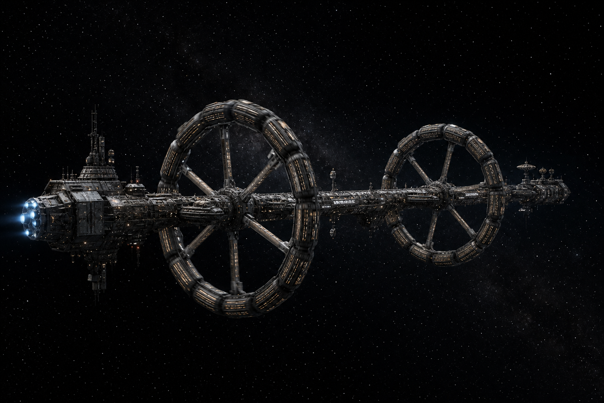
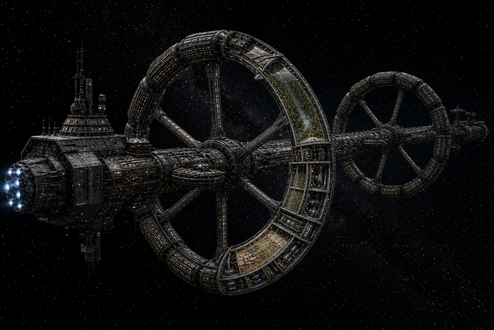
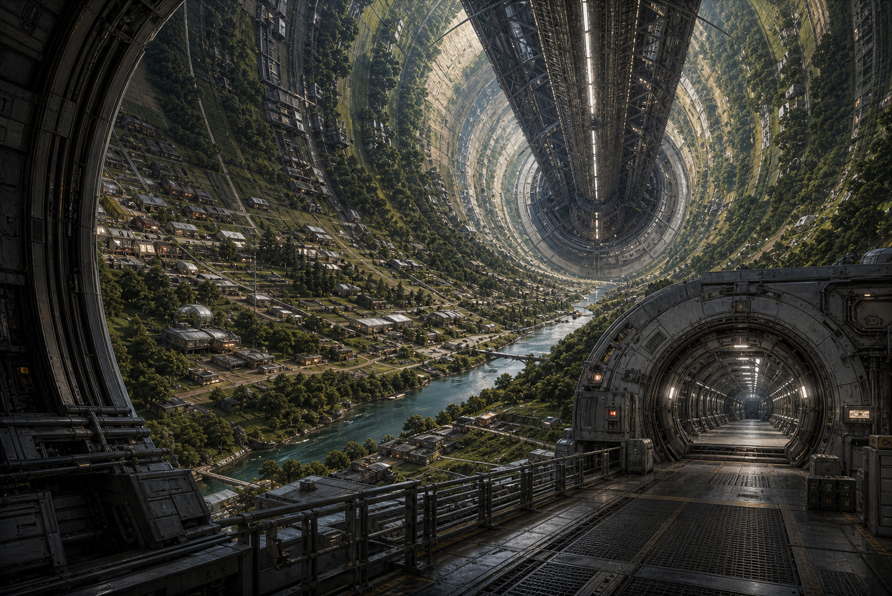
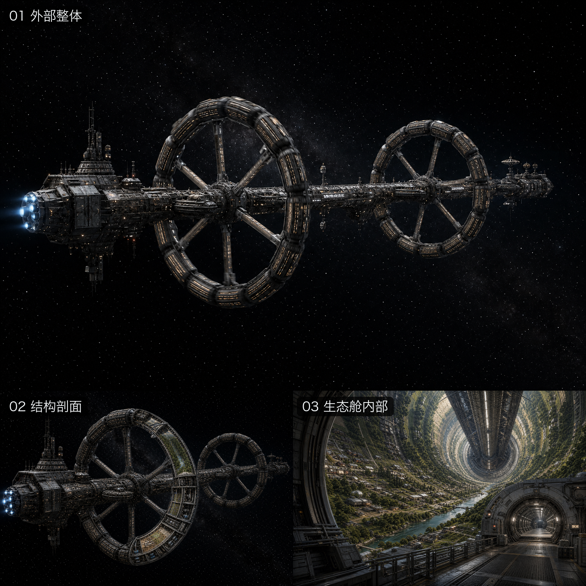

# 《极光》飞船评测参考图

日期：2026-08-07

## 使用边界

本组图片是根据《极光》中跨世代飞船的公开文字描述制作的评测参考，不是作者或出版方发布的官方设定图，也不代表原著只有这一种可接受的视觉解释。

评分时应优先判断被测项目是否体现核心结构与工程逻辑，不要求外形、材质和配色与本图逐像素一致。

## 参考图

### 1. 外部整体

重点观察：

- 长距离星际航行的跨世代飞船尺度。
- 中央非旋转长轴。
- 两组独立旋转的居住轮组。
- 居住舱、轮毂、辐条、推进和维护结构之间的关系。
- 是否避免退化成普通战舰、飞碟或流线型客运飞船。

### 2. 结构剖面

重点观察：

- 居住轮内部是否包含真正的生态和生活空间。
- 生态舱与轮毂、辐条、中央轴是否能够连通。
- 是否存在压力隔离、维护层、交通和基础设施。
- 内外部结构是否具有一致的空间逻辑。

### 3. 生态舱内部

重点观察：

- 地面是否沿旋转圆柱的内壁向两侧上弯。
- 是否体现旋转产生的人工重力，而不是普通星球地表。
- 是否同时具备生态、居住、农业和机械维护空间。
- 是否提供通向辐条、轮毂或其他舱段的探索入口。

### 4. 组合总览

## 建议评分口径

- 参考图用于帮助判断“设定是否具体且自洽”，不是要求被测项目复制相同造型。
- 如果项目只有一艘通用科幻飞船，没有中央轴、旋转居住结构或生态舱依据，可按原规则将总分限制在 5 分。
- 如果只有外观展示，无法进入内部空间探索，可按原规则将总分限制在 7 分。
- 内部场景如果只是普通走廊，无法体现旋转生态舱、人工重力或跨世代居住功能，内部空间项不应给满分。
- 旋转、缩放、内外切换和航行动画必须实际可操作，不能仅凭截图判断。
- 项目能否运行、交互是否稳定仍需在浏览器中单独验证，参考图不能替代功能测试。
