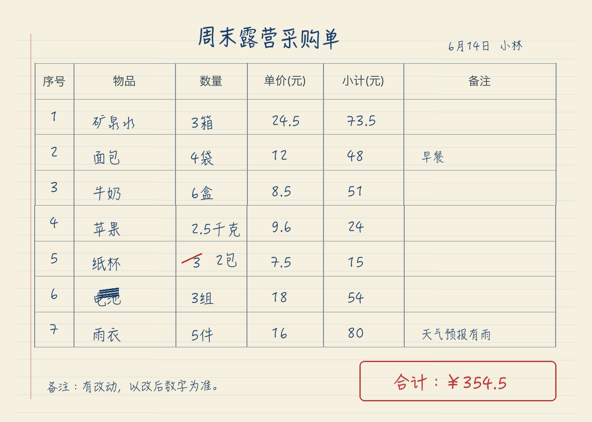
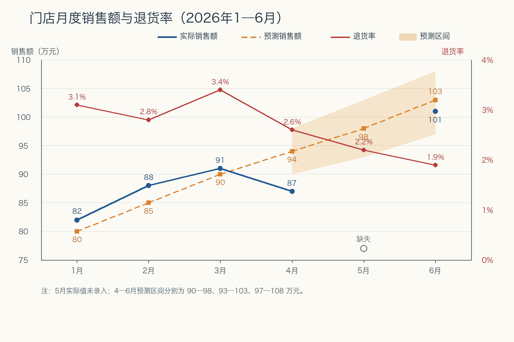
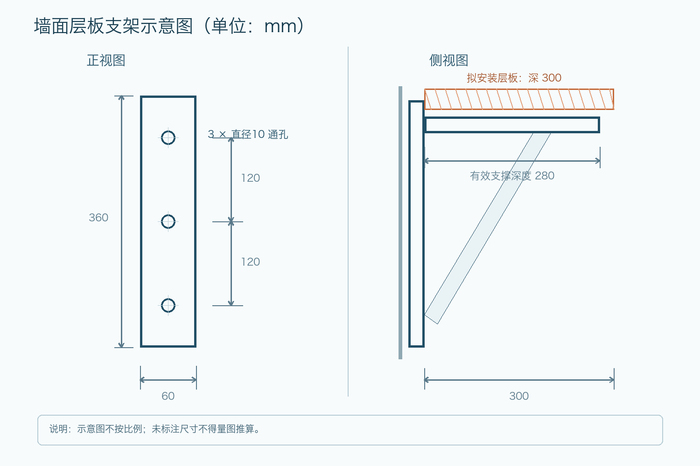

# 多模态能力测试（4 题）

## 作答规则

1. 请按原图作答，不得联网搜索；
2. 逐题、逐问编号回答，计算题写出过程；
3. 图片中看不清的文字请标记为“[不清晰]”，不要根据常识补全；
4. 无法仅凭图片确定的结论，请明确回答“无法确定”并说明缺少什么信息；
5. 每题建议时限 8 分钟。系统另行记录首段输出时间和完整回答时间，不要求自行估计。

---

## MM1 实景街景

图片署名：The City of Toronto / Jose San Juan，CC BY 2.0。

请回答：

1. 准确抄录以下信息：
   - 蓝色街道路牌上的街道名；
   - 禁止左转标志下方的两个时间段和适用日期；
   - 有轨电车正面电子牌的路线号、终点和途经道路；
   - 有轨电车车身编号。
2. 画面中的主要悬挂式机动车信号灯和右下方行人信号灯分别显示什么？指出画面中一处加拿大国家标志及其大致位置。
3. 仅根据画面中的禁左转标志，星期一上午 8:00 能否左转？星期一中午 12:00 呢？分别说明理由。
4. 能否仅凭这张图片确定该道路的限速，以及有轨电车在拍摄瞬间是否正在移动？分别说明。

---

## MM2 手写表格

请回答：

1. 按行抄录 7 项采购记录，至少包括物品、数量、单价、小计和备注。看不清的字必须标记为“[不清晰]”；
2. 哪一项的数量被修改过？原数字和修改后的有效数量分别是什么？
3. 根据修改后的数量重新计算全部采购金额。纸面合计是否正确？若不正确，相差多少，纸面金额是多写还是少写？
4. 仅凭这张表，能否证明这些物品已经付款？能否确定采购商店？分别说明。

---

## MM3 复杂图表

请回答：

1. 分别列出 1—6 月的实际销售额和预测销售额；没有实际值的月份不得填 0；
2. 列出 1—6 月退货率，并抄录 4—6 月三个预测区间；
3. 计算：
   - 1—3 月实际销售额合计、预测销售额合计及两者差额；
   - 4—6 月预测销售额合计；
   - 4—6 月实际销售额合计能否准确计算，为什么？
4. 这张图的左轴设计可能怎样影响读者对销售额变化的感受？能否据此断言“退货率下降导致销售额上升”？说明理由。

---

## MM4 工程草图

请回答：

1. 读出图中支架安装板的高度、宽度、孔数量、孔直径、相邻孔中心距、有效支撑深度和拟安装层板深度；
2. 最上方孔与最下方孔的中心距离是多少？若每个孔都使用，需要在墙上打几个孔？
3. 如果安装要求是“层板深度不得超过有效支撑深度”，图中的拟安装层板是否满足要求？相差多少？
4. 图中的“直径 10 通孔”是否等于必须使用直径 10 mm 的螺钉？能否仅凭这张图确定支架材料、螺钉长度、墙体类型和额定承重？说明理由。
